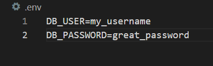
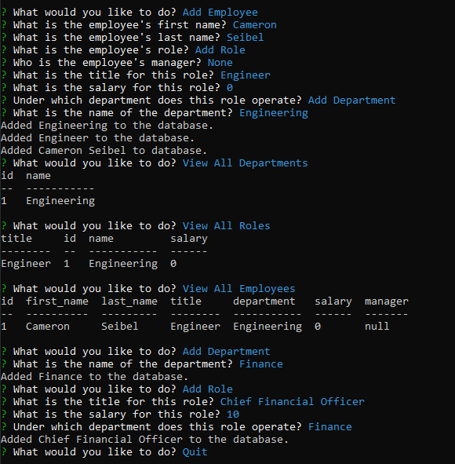

# Employee Tracker
	
## Description

Employee Tracker provides small businesses with the ability to effectively manage employee departments, roles and salaries. It is a simple command line interface that interacts with MySQL to maintain a database housing employee information.

## Table of Contents

- [Installation](#installation)
- [Usage](#usage)
- [Questions](#questions)

## Installation

To install, clone this repository and install all dependencies. Run the `schema.sql` script found in the `db` directory. Create a `.env` file with the properties `DB_USER` and `DB_PASSWORD`, and assign your MySQL credentials accordingly. See below for an example of the `.env` file.

## Usage

To use the program, navigate to directory where `tracker.js` is located, and run either `node tracker.js` or `npm start`. From there, follow the instructions in the command line interface to maintain your employee database. A video tutorial can be found [here](https://youtu.be/av3ggtdc8Eg).

## Questions

I can be found on GitHub [here](https://github.com/CameronMSeibel).
If you have any questions, I can be reached at cam.m.seib@gmail.com

